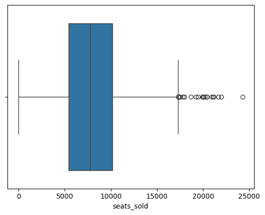
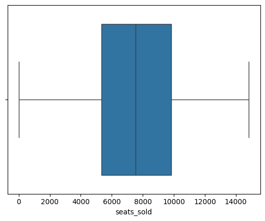

# WELCOME TO BROADWAY!!


Is Broadway in danger?? such a colorful, joyful world full of music, dancing, creativity faces one of the biggest challenges: survive. The financial crisis together with Covid-19 pandemics and a lack of new ideas for musicals were issues that may affect the productivity and therefore the profits obtained from shows. Will be humans living in a Miserábles world, without a Phantom of the Opera, a defying gravity Wicked or the felinity of Cats?

**Let the show begin!**


## **Table of Contents**

* Data Sources
* Metadata
* General Exploratory Data Analysis (EDA)
* Time Series Analysis
* Regression Analysis: specific EDA, Feature Engineering, Preprocessing
* Linear Regression Modelling
* To wrap up (Conclusions)


## *Data Sources*

Data was obtained from Kaggle (PlayBill), more specifically *from the Broadway Weekly Grosses Dataset* (https://www.kaggle.com/datasets/jessemostipak/broadway-weekly-grosses?select=grosses.csv). This dataset is related to the weekly grosses obtained by theatres from The Broadway League, which is an association for Broadway Theatre. It's compounded of 13 variables and around 48k observations.

There were also data on synopsis, cpi and other musicals starting before 1985. However for this analysis this information was
considered unnecessary and therefore was discarded.

## *Data Dictionary*

- **week_ending**: Date of the end of the weekly measurement period. Always a Sunday.
- **week_number**: Week number in the Broadway season. The season starts after the Tony Awards, held in early June. Some seasons have 53 weeks.
- **weekly_gross_overall**: Weekly box office gross for all shows
- **show**: Name of show. Some shows have the same name, but multiple runs.
- **theatre**: Name of theatre
- **weekly_gross**: Weekly box office gross for individual show
- **potential_gross**: Weekly box office gross if all seats are sold at full price. Shows can exceed their potential gross by selling premium  tickets and/or standing room tickets.
- **avg_ticket_price**: Average price of tickets sold
- **top_ticket_price**: Highest price of tickets sold
- **seats_sold**: Total seats sold for all performances and previews
- **seats_in_theatre**: Theatre seat capacity
- **pct_capacity**: Percent of theatre capacity sold. Shows can exceed 100% capacity by selling standing room tickets.
- **performances**: Number of performances in the week
- **previews**: Number of preview performances in the week. Previews occur before a show's official open.

## *General Exploratory Data Analysis*


A general overview of all the variables was made in order to get a glimpse of how these were (how many unique values these variables had, a description of the numerical variables to check their summary values, the presence of missing data, the presence of duplicated observations and so on):

```Python
nulls = pd.DataFrame(df_grosses.isna().sum()/len(df_grosses))
nulls = nulls.reset_index()
nulls.columns = ['column_name', 'Percentage Null Values']
nulls.sort_values(by='Percentage Null Values', ascending = False)
```
<table border="1" class="dataframe">
  <thead>
    <tr style="text-align: right;">
      <th></th>
      <th>column_name</th>
      <th>Percentage Null Values</th>
    </tr>
  </thead>
  <tbody>
    <tr>
      <th>6</th>
      <td>potential_gross</td>
      <td>0.265403</td>
    </tr>
    <tr>
      <th>8</th>
      <td>top_ticket_price</td>
      <td>0.238974</td>
    </tr>
    <tr>
      <th>0</th>
      <td>week_ending</td>
      <td>0.000000</td>
    </tr>
    <tr>
      <th>1</th>
      <td>week_number</td>
      <td>0.000000</td>
    </tr>
    <tr>
      <th>2</th>
      <td>weekly_gross_overall</td>
      <td>0.000000</td>
    </tr>
    <tr>
      <th>3</th>
      <td>show</td>
      <td>0.000000</td>
    </tr>
    <tr>
      <th>4</th>
      <td>theatre</td>
      <td>0.000000</td>
    </tr>
    <tr>
      <th>5</th>
      <td>weekly_gross</td>
      <td>0.000000</td>
    </tr>
    <tr>
      <th>7</th>
      <td>avg_ticket_price</td>
      <td>0.000000</td>
    </tr>
    <tr>
      <th>9</th>
      <td>seats_sold</td>
      <td>0.000000</td>
    </tr>
    <tr>
      <th>10</th>
      <td>seats_in_theatre</td>
      <td>0.000000</td>
    </tr>
    <tr>
      <th>11</th>
      <td>pct_capacity</td>
      <td>0.000000</td>
    </tr>
    <tr>
      <th>12</th>
      <td>performances</td>
      <td>0.000000</td>
    </tr>
    <tr>
      <th>13</th>
      <td>previews</td>
      <td>0.000000</td>
    </tr>
  </tbody>
</table>
</div>


The database was quite clean and only three variables had some missing data, but not enough to discard them for this reason. Also, no duplicate observations were found.

## *Time Series Analysis*


For this analysis, the variable 'week_ending' was considered, together with our variable of interest (weekly_grosses). 'week_ending'  was transformed to a datetime variable in order to perform the analysis and sorted from early to late dates. First and last value were checked to see the temporal scope (June 1985 to March 2020). This showed no effects from Covid-19 pandemia would affect here. 

Perfoming a weekly analysis we can see a nice increasing trend of the period 1985-2020 (march). Weekly grosses smoothly increase over time:


However, there is a fall in Jan2016. Taking a closer look:


Weekly grosses were 0! this was due to a heavy snowfall that happened in that year that obligued theatres to close (no public transportation was available either for quite a long time). Source: https://ew.com/article/2016/01/23/broadway-shows-nyc-canceled-snowstorm/

By looking at the weekly and weekly average trends (rolling window) we can see they're in line:


In order to check how the weekly grosses would be affected in the 'future' a 2-year prediction was performed with Prophet:


In this graph the outlier week from 2016 can be also distinguished. The projections seem to have an increasing tendency, as expected. Note that this is not what actually happened...but no one (not even Prophet) expected Covid-19 to appear!!


The components show a clear increasing tendency of the weekly grosses over the years. Also, the pattern within a year shows that summer months show higher weekly grosses (theatre season starts in June, also summer holidays); they decrease in September (back to work, back to school) and increase again in November-December (Christmas, cheap flights, etc.)

Acknowledging that we have not accounted for inflation in this analysis. Further analysis should be conducting taking into account this fact.


## *Regression Analysis*

### Specific Exploratory Data Analysis of Categorical Variables

In order to check for the relation between the categorical variables a crosstab of both theaters and shows was performed. Usually, Broadway shows are always hosted in the same theatres so it was expected a relationship between these variables. When performing looking at the Chi-Squared p-values this is 0, showing that we definitely can reject the null hypothesis (H0: there is no relationship between both variables). In order to avoid multicollinearity, variable theatres was dropped (grosses should be more related to shows than to theatres).

Given the huge amount of unique values in the variable 'show' (n=1,122 in 'shows') this variable was treated in order to be included in the model.

A new variable called 'musical_type' was created to classify shows into one of the following categories:

- Legit: classically voiced singing with characteristics of nice rounded vowels, clear diction, lots of vibrato, smooth transitions, beautiful sustained notes and vocal flexibility.

- Mixed: if the shows feature diverse musical influences, from Classical to Pop/Rock and everything in between.

- Pop-Rock:decidedly pop/rock influenced, though that still covers a broad range of styles.

- Other: shows that do not fall into any of the mentioned categories.

Acknowledging that the other category includes too many musicals. Further exhaustive research on musical categories to better classify shows.

```Python
df_grosses.musical_type.value_counts()

musical_type
other       37413
mixed        4993
pop_rock     4184
legit         934
Name: count, dtype: int64
  ```


### Specific Exploratory Data Analysis of Numerical Variables

An initial correlation matrix was conducted to check for multicollinearity in the numerical variables. The dependant variable (weekly_gross) was already included to check for multicollinearity with the other variables and see if any explicative variable was highly correlated to it. 


There is a high correlation (>0.9) between variables 'performance' and 'previews'. Previews was then dropped from the database in order to avoid model overfitting. 'Previews' was chosen as 'performances' was consider more relevant to explain the weekly grosses; it also had more 0s than 'performances'.

Scatterplots were made in order to check whether there was a linearity between the dependant variable (week_gross) and each of the explanatory variables:


Some associations show a linear positive relationship (when one variable increases, the other does too) such as avg_ticket price or seats sold. However, others such as number of weeks show a different shape (more uniform).

Then, distributions of each numeric variable were checked using a histogram. Also, missing values where imputed using the mean values of the corresponding variable. Finally, cases where the value had no sense it was also treated (e.g. the variable seats in theatre had some 0s, so these were transformed to null and then imputed).


Transformations were made based on logarithms or square roots. If the distribution contained 0s (none had negative values) the squared root method was considered the first option, as logarithms of 0 are 1 and the variable would be weighted to 1. In any case, both methods were checked to see which one produced a more normalized distribution. The transformed variable was added to the dataframe and the original variable was dropped.


Outliers were then revised by checking the distributions. Most variables had a bit of positive skewness,except the average ticket price that had both positive and negative. Boxplots were also revised to see the outliers more easily. Let´s see the seats sold to illustrate this:



Some other variables such as the performances did not required treatment of outliers or the distribution was not a Normal (e.g. week number, which is basically Uniform).

The Interquartile Range (IQR) was calculated for each variables with outliers. This measures the values that fall between the 1st and the 3rd quartile (therefore excluding extreme values). Upper or lower limits were constructed to exclude those values considered extreme. if the N of outliers was small and reasonable enough, these were dropped from the variables. Then, distributions and plots were again revised to check the shape of the variables after this transformation.



The correlation matrix was plotted again after the transformations. On those variables where the correlation was higher than 0.7 regressions of Xs were made to double-check them:

```Python
model = LinearRegression().fit(regression[['seats_sold']], regression[['seats_in_theatre']])
model.score(regression[['seats_sold']], regression[['seats_in_theatre']])

0.6505750768993934
```

```Python
model = LinearRegression().fit(regression[['weekly_gross_overall_sqrt']], regression[['avg_ticket_price_sqrt']])
model.score(regression[['weekly_gross_overall_sqrt']], regression[['avg_ticket_price_sqrt']])

0.6320184747446843
```

None of them were discarded as the R2 was considered not high enough.

### Final Steps before the Model:
Now variables were clean and transformed, categorical variables were encoded in order to be included in the model. The encoding was performed using the OneHotEncoder from Sklearn. One of the categories (legit) was not considered by this method in order to avoid model overfitting.

Before running the OLS model, given that some variables still had quite many outliers I decided to transform by nomalising and then trying the other two methods: scaling and standarising. The differences that these methods represent to the model interpretation are varied and out of the Scope of this project, so for now we will stick to the one that provides more reasonable results (histograms, model fit, coefficients, etc.)

Numerical data was then normalized, scaled and standarised (also with the Normalizer, MinMaxScaler and StandardScaler methods from Sklearn) to check the best method to transform the data.

## Regression Modelling


The OLS model was presented using the Linear Regression Library:

``` Python

                            OLS Regression Results                            
==============================================================================
Dep. Variable:      weekly_gross_sqrt   R-squared:                       0.612
Model:                            OLS   Adj. R-squared:                  0.612
Method:                 Least Squares   F-statistic:                     6425.
Date:                Wed, 08 May 2024   Prob (F-statistic):               0.00
Time:                        15:34:40   Log-Likelihood:            -2.8550e+05
No. Observations:               44765   AIC:                         5.710e+05
Df Residuals:                   44753   BIC:                         5.711e+05
Df Model:                          11                                         
Covariance Type:            nonrobust                                         
=============================================================================================
                                coef    std err          t      P>|t|      [0.025      0.975]
---------------------------------------------------------------------------------------------
const                        36.3796     23.403      1.554      0.120      -9.490      82.250
week_number               -1.346e+04    324.584    -41.454      0.000   -1.41e+04   -1.28e+04
seats_sold                 1093.9587     18.783     58.243      0.000    1057.144    1130.773
seats_in_theatre          -1469.8371     23.544    -62.428      0.000   -1515.985   -1423.690
performances              -1.326e+05   1927.770    -68.788      0.000   -1.36e+05   -1.29e+05
weekly_gross_overall_sqrt   206.8289     14.444     14.319      0.000     178.518     235.140
potential_gross_sqrt      -1196.7614     38.936    -30.737      0.000   -1273.076   -1120.447
avg_ticket_price_sqrt      2.768e+05   5227.149     52.961      0.000    2.67e+05    2.87e+05
top_ticket_price_sqrt     -1.962e+04   2362.333     -8.307      0.000   -2.43e+04    -1.5e+04
musical_type_mixed           12.6413      5.258      2.404      0.016       2.335      22.947
musical_type_other         -125.1468      4.777    -26.196      0.000    -134.510    -115.783
musical_type_pop_rock         4.5272      5.246      0.863      0.388      -5.755      14.810
==============================================================================
Omnibus:                      638.117   Durbin-Watson:                   1.440
Prob(Omnibus):                  0.000   Jarque-Bera (JB):              730.093
Skew:                           0.247   Prob(JB):                    2.90e-159
Kurtosis:                       3.384   Cond. No.                     1.28e+04
==============================================================================

Notes:
[1] Standard Errors assume that the covariance matrix of the errors is correctly specified.
[2] The condition number is large, 1.28e+04. This might indicate that there are
strong multicollinearity or other numerical problems.

```

Most variables are significant (i.e. make an effect in the dependant variable) except the fact that the musical was a pop-rock musical or mixed, as well as the constant. This is also shown in the fact that the confidence intervals for these variables include the 0. As a result, the effect of these inputs may be any (positive, zero, negative) so no conclusions can be extracted from them. 

Other variables such as the top price of tickets or the number of seats sold clearly have an impact on weekly grosses. For example, a seat sold increases the weekly grosses in 1,093$. The fit of the model seems pretty good given that the R2 is 0.61 (61% of variations in Y can be explained by variations in Xs).

The fact that the constant itself is non-significant is a bit suspicious so let's see other transformations.

When we standarise or scale the variables the results differ!:

*Scaled Model*

``` Python 
                            OLS Regression Results                            
==============================================================================
Dep. Variable:      weekly_gross_sqrt   R-squared:                       0.989
Model:                            OLS   Adj. R-squared:                  0.989
Method:                 Least Squares   F-statistic:                 3.717e+05
Date:                Wed, 08 May 2024   Prob (F-statistic):               0.00
Time:                        15:35:08   Log-Likelihood:            -2.0541e+05
No. Observations:               44765   AIC:                         4.108e+05
Df Residuals:                   44753   BIC:                         4.109e+05
Df Model:                          11                                         
Covariance Type:            nonrobust                                         
=============================================================================================
                                coef    std err          t      P>|t|      [0.025      0.975]
---------------------------------------------------------------------------------------------
const                      -130.8821      1.069   -122.468      0.000    -132.977    -128.787
week_number                   0.1908      0.384      0.497      0.619      -0.562       0.943
seats_sold                  642.8918      1.050    612.161      0.000     640.833     644.950
seats_in_theatre            -46.4853      0.881    -52.759      0.000     -48.212     -44.758
performances                  2.2143      0.637      3.474      0.001       0.965       3.464
weekly_gross_overall_sqrt    -1.6641      0.900     -1.849      0.064      -3.428       0.100
potential_gross_sqrt        164.4566      1.397    117.690      0.000     161.718     167.195
avg_ticket_price_sqrt       844.8579      1.323    638.435      0.000     842.264     847.452
top_ticket_price_sqrt       -30.2548      1.142    -26.486      0.000     -32.494     -28.016
musical_type_mixed            9.6537      0.882     10.944      0.000       7.925      11.383
musical_type_other           -2.8764      0.806     -3.568      0.000      -4.457      -1.296
musical_type_pop_rock         2.0196      0.879      2.298      0.022       0.297       3.742
==============================================================================
Omnibus:                    12541.618   Durbin-Watson:                   1.828
Prob(Omnibus):                  0.000   Jarque-Bera (JB):           116760.624
Skew:                          -1.081   Prob(JB):                         0.00
Kurtosis:                      10.611   Cond. No.                         30.8
==============================================================================

Notes:
[1] Standard Errors assume that the covariance matrix of the errors is correctly specified.

```

*Standardised Model*
``` Python
                            OLS Regression Results                            
==============================================================================
Dep. Variable:      weekly_gross_sqrt   R-squared:                       0.989
Model:                            OLS   Adj. R-squared:                  0.989
Method:                 Least Squares   F-statistic:                 3.717e+05
Date:                Wed, 08 May 2024   Prob (F-statistic):               0.00
Time:                        15:56:16   Log-Likelihood:            -2.0541e+05
No. Observations:               44765   AIC:                         4.108e+05
Df Residuals:                   44753   BIC:                         4.109e+05
Df Model:                          11                                         
Covariance Type:            nonrobust                                         
=============================================================================================
                                coef    std err          t      P>|t|      [0.025      0.975]
---------------------------------------------------------------------------------------------
const                       673.7014      0.794    848.958      0.000     672.146     675.257
week_number                   0.0564      0.113      0.497      0.619      -0.166       0.279
seats_sold                  130.7509      0.214    612.161      0.000     130.332     131.169
seats_in_theatre            -10.9439      0.207    -52.759      0.000     -11.350     -10.537
performances                  0.4153      0.120      3.474      0.001       0.181       0.650
weekly_gross_overall_sqrt    -0.3792      0.205     -1.849      0.064      -0.781       0.023
potential_gross_sqrt         21.3115      0.181    117.690      0.000      20.957      21.666
avg_ticket_price_sqrt       143.9100      0.225    638.435      0.000     143.468     144.352
top_ticket_price_sqrt        -4.4050      0.166    -26.486      0.000      -4.731      -4.079
musical_type_mixed            9.6537      0.882     10.944      0.000       7.925      11.383
musical_type_other           -2.8764      0.806     -3.568      0.000      -4.457      -1.296
musical_type_pop_rock         2.0196      0.879      2.298      0.022       0.297       3.742
==============================================================================
Omnibus:                    12541.618   Durbin-Watson:                   1.828
Prob(Omnibus):                  0.000   Jarque-Bera (JB):           116760.624
Skew:                          -1.081   Prob(JB):                         0.00
Kurtosis:                      10.611   Cond. No.                         24.7
==============================================================================

Notes:
[1] Standard Errors assume that the covariance matrix of the errors is correctly specified.

```

The R2 in both standarised and scaled models is too good! are overfitting the model? why the normalised is better and the other 2 exactly match in such a high number?

When revising again the distributions of the normalised, standard and scaled variables:

*Normalised*


*Scaled*


*Standarised*


Results show that the normalised distributions are now skewed! however, the shape of the standarised and scaled variables is practically identical and much more centered. The normalisation is not a good approach for this dataset. This means that the weekly grosses is really well explained by the explicative variables selected (almost 100% of variations in weekly grosses can be explained by the chosen Xs).

### Wait! but...is it not TOO good? 😳

Maybe the reason for such good fit is that we are including variables that are highly correlated to the weekly grosses (i.e. we are using variables to explain the model that are in a way part of the Y itself!). The correlation matrix didn't show it but the average ticket price is the same ass the grosses by the number of tickets sold. As we are talking aobut the average the correlation does not show so clear in the matrix. 
Also, variable 'seats in theatre' is quite correlated to seats sold. And 'potential gross' as well as 'weekly gross overall' might be quite related to the weekly grosses, isn't it? There is quite high correlation (~0.6-0.7) between some dependant variables and also with the Y itself. So...let's take all these out from the analysis!


*Standardised*

``` Python

                            OLS Regression Results                            
==============================================================================
Dep. Variable:      weekly_gross_sqrt   R-squared:                       0.742
Model:                            OLS   Adj. R-squared:                  0.742
Method:                 Least Squares   F-statistic:                 1.840e+04
Date:                Wed, 08 May 2024   Prob (F-statistic):               0.00
Time:                        16:03:24   Log-Likelihood:            -2.7636e+05
No. Observations:               44765   AIC:                         5.527e+05
Df Residuals:                   44757   BIC:                         5.528e+05
Df Model:                           7                                         
Covariance Type:            nonrobust                                         
=========================================================================================
                            coef    std err          t      P>|t|      [0.025      0.975]
-----------------------------------------------------------------------------------------
const                   709.1024      3.839    184.696      0.000     701.577     716.628
week_number              -1.2766      0.552     -2.315      0.021      -2.358      -0.196
seats_sold              160.7315      0.578    278.108      0.000     159.599     161.864
performances              6.3664      0.570     11.178      0.000       5.250       7.483
top_ticket_price_sqrt    75.6531      0.585    129.387      0.000      74.507      76.799
musical_type_mixed        4.3528      4.269      1.020      0.308      -4.014      12.719
musical_type_other      -50.3583      3.896    -12.924      0.000     -57.995     -42.721
musical_type_pop_rock    41.6850      4.267      9.768      0.000      33.321      50.049
==============================================================================
Omnibus:                      501.524   Durbin-Watson:                   0.794
Prob(Omnibus):                  0.000   Jarque-Bera (JB):              444.847
Skew:                          -0.195   Prob(JB):                     2.53e-97
Kurtosis:                       2.706   Cond. No.                         18.7
==============================================================================

Notes:
[1] Standard Errors assume that the covariance matrix of the errors is correctly specified.

```
The standarised histograms have now this shape:


In this case, the model fits much more reasonable...the R2 tells us that 75% of the changes in weekly grosses are explained by variations in the Xs. The variable 'weeknumber' is non significant but it makes sense as it has no linear relationship with the Y. The rest of the variables show a clear significance to the Y.
If we touch nothing else, the weekly grosses are approximately $756 using this model. The number of performances, seats sold and the value of the top ticket price increase weekly grosses. Also, pop-rock musicals incrase profits more than other types of musicals. 

### Split, train, test

In order to check the model, we are goint to split it to have a part to be trained (80%) and a part to be tested (20%):

```Python 
X=pd.concat((df_x_standarised, df_x_encoded), axis=1) 
Y=pd.DataFrame(Y)
X_train, X_test, y_train, y_test= train_test_split(X,Y, test_size=0.8, random_state=42)
lm=linear_model.LinearRegression()
model=lm.fit(X_train, y_train)
predictions=lm.predict(X_test)

r2=r2_score(y_test, predictions)
print(r2)

0.74174370719498

``` 

After the training and the test, predictions show that the R2 of the model is 0.75, which is very similar to the OLS model. We can say our model is robust.


## *Conclusions*


Broadway is a world full of magic and sound...but also full of profits. Time Series analysis show the positive tendency over years regarding grosses (unless something unexpected happens!). The linear regression OLS model shows that, when accounting for outliers, skeweness and missing values, the weekly grosses can be explained not only for the shows displayed but also for the theatres, the ticket sales and the number of performances. In order to save Broadway efforts need to be directed to increase the quantity and quality of performances to fill enough seats and carefully consider ticket prices. Focusing on improving these variables we may help Broadway survive!!

**Let's keep believing in magic...**


