# Project Broadway: Time Series Analysis and Linear Regressions on Weekly Gross

## WELCOME TO BROADWAY!!


Broadway is the paradise for those who are in love with lights, colors, dancing and music. Throughout the vast History of this Boulevard tons of musicals and shows have passed by. Some more successful than others...but variety was everywhere. Broadway has attracted thousands of visitors not only from New York or the States, but from all around the world. This is not only traduced in millions of happy singing and clapping while enjoying the show...but also in revenues for producers, directors, actors and all those who live from it. 

Let the show begin!


## **Table of Contents**

* Data Sources
* Metadata
* General Exploratory Data Analysis (EDA)
* Time Series Analysis
* Regression Analysis: specific EDA, Feature Engineering, Preprocessing
* Linear Regression Modelling
* To wrap up (Conclusions)


### Data Sources
Data was obtained from Kaggle (PlayBill), more specifically *from the Broadway Weekly Grosses Dataset* (https://www.kaggle.com/datasets/jessemostipak/broadway-weekly-grosses?select=grosses.csv). This dataset is related to the weekly grosses obtained by theatres from The Broadway League, which is an association for Broadway Theatre. It's compounded of 13 variables and around 48k observations.

There were also data on synopsis, cpi and other musicals starting before 1985. However for this analysis this information was
considered unnecessary and therefore was discarded.

### Metadata

- week_ending: Date of the end of the weekly measurement period. Always a Sunday.
- week_number: Week number in the Broadway season. The season starts after the Tony Awards, held in early June. Some seasons have 53 weeks.
- weekly_gross_overall: Weekly box office gross for all shows
- show: Name of show. Some shows have the same name, but multiple runs.
- theatre: Name of theatre
- weekly_gross: Weekly box office gross for individual show
- potential_gross: Weekly box office gross if all seats are sold at full price. Shows can exceed their potential gross by selling premium  tickets and/or standing room tickets.
- avg_ticket_price: Average price of tickets sold
- top_ticket_price: Highest price of tickets sold
- seats_sold: Total seats sold for all performances and previews
- seats_in_theatre: Theatre seat capacity
- pct_capacity: Percent of theatre capacity sold. Shows can exceed 100% capacity by selling standing room tickets.
- performances: Number of performances in the week
- previews: Number of preview performances in the week. Previews occur before a show's official open.

### General Exploratory Data Analysis


A general overview of all the variables was made in order to get a glimpse of how these were (how many unique values these variables had, a description of the numerical variables to check their summary values, the presence of missing data, the presence of duplicated observations and so on):

```Python
nulls = pd.DataFrame(df_grosses.isna().sum()/len(df_grosses))
nulls = nulls.reset_index()
nulls.columns = ['column_name', 'Percentage Null Values']
nulls.sort_values(by='Percentage Null Values', ascending = False)
```
<table border="1" class="dataframe">
  <thead>
    <tr style="text-align: right;">
      <th></th>
      <th>column_name</th>
      <th>Percentage Null Values</th>
    </tr>
  </thead>
  <tbody>
    <tr>
      <th>6</th>
      <td>potential_gross</td>
      <td>0.265403</td>
    </tr>
    <tr>
      <th>8</th>
      <td>top_ticket_price</td>
      <td>0.238974</td>
    </tr>
    <tr>
      <th>0</th>
      <td>week_ending</td>
      <td>0.000000</td>
    </tr>
    <tr>
      <th>1</th>
      <td>week_number</td>
      <td>0.000000</td>
    </tr>
    <tr>
      <th>2</th>
      <td>weekly_gross_overall</td>
      <td>0.000000</td>
    </tr>
    <tr>
      <th>3</th>
      <td>show</td>
      <td>0.000000</td>
    </tr>
    <tr>
      <th>4</th>
      <td>theatre</td>
      <td>0.000000</td>
    </tr>
    <tr>
      <th>5</th>
      <td>weekly_gross</td>
      <td>0.000000</td>
    </tr>
    <tr>
      <th>7</th>
      <td>avg_ticket_price</td>
      <td>0.000000</td>
    </tr>
    <tr>
      <th>9</th>
      <td>seats_sold</td>
      <td>0.000000</td>
    </tr>
    <tr>
      <th>10</th>
      <td>seats_in_theatre</td>
      <td>0.000000</td>
    </tr>
    <tr>
      <th>11</th>
      <td>pct_capacity</td>
      <td>0.000000</td>
    </tr>
    <tr>
      <th>12</th>
      <td>performances</td>
      <td>0.000000</td>
    </tr>
    <tr>
      <th>13</th>
      <td>previews</td>
      <td>0.000000</td>
    </tr>
  </tbody>
</table>
</div>


The database was quite clean and only three variables had some missing data, but not enough to discard them for this reason. Also, no duplicate observations were found.

## Time Series Analysis


For this analysis, the variable 'week_ending' was considered, together with our variable of interest (weekly_grosses). 'week_ending'  was transformed to a datetime variable in order to perform the analysis and sorted from early to late dates. First and last value were checked to see the temporal scope (June 1985 to March 2020). This showed no effects from Covid-19 pandemia would affect here. 

Perfoming a weekly analysis we can see a nice increasing trend of the period 1985-2020 (march). Weekly grosses smoothly increase over time:

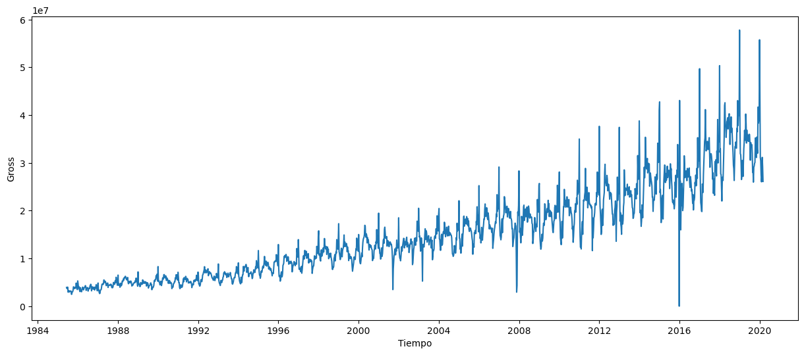

However, there is a fall in jan2016. Taking a closer look:

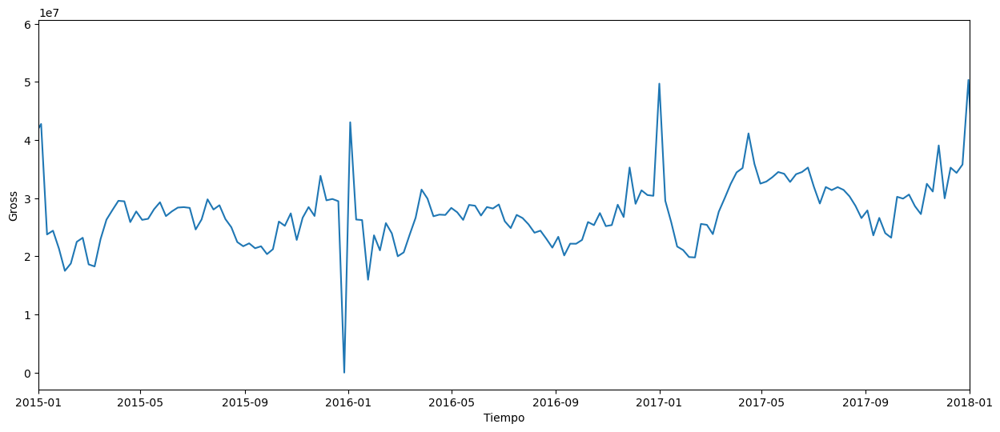

Weekly grosses were 0! this was due to a heavy snowfall that happened in that year that obligued theatres to close (no public transportation was available either). Source: https://ew.com/article/2016/01/23/broadway-shows-nyc-canceled-snowstorm/

By looking at the weekly and weekly average trends (rolling window) we can see they're in line:

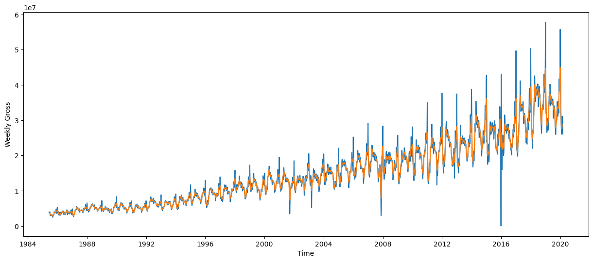

In order to check how the weekly grosses would affect in the next years a 2-year prediction was performed with Prophet:

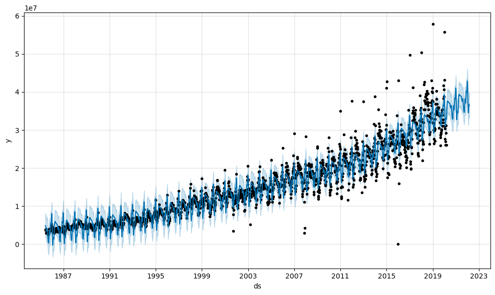

In this graph the outlier week from 2016 can be also distinguished. The projections seem to have an increasing tendency, as expected. Note that this is not what actually happened...but no one (not even Prophet) expected Covid-19 to appear!!

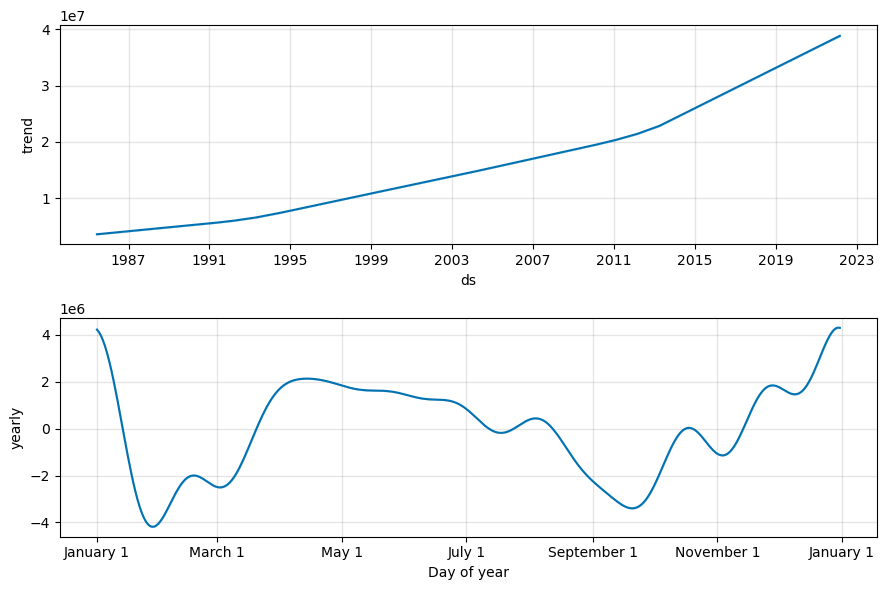

The components show a clear increasing tendency of the weekly grosses over the years. Also, the pattern within a year shows that summer months show higher weekly grosses (theatre season starts in June, also summer holidays...) decreases in September (back to work, back to school) and increases again in November-December (Christmas maybe?)


## Regression Analysis

### Specific Exploratory Data Analysis of Categorical Variables

Given the huge amount of unique values in the categorical variables (n=xx in 'shows' and n=xx in 'theatres') these variables were treated to be included in the model.

A new variable called 'musical_type' was created to classify shows into one of the following categories:

- Legit: classically voiced singing with characteristics of nice rounded vowels, clear diction, lots of vibrato, smooth transitions, beautiful sustained notes and vocal flexibility.

- Mixed: if the shows feature diverse musical influences, from Classical to Pop/Rock and everything in between.

- Pop-Rock:decidedly pop/rock influenced, though that still covers a broad range of styles.

- Other: shows that do not fall into any of the mentioned categories.


```Python
df_grosses.musical_type.value_counts()

musical_type
other       37413
mixed        4993
pop_rock     4184
legit         934
Name: count, dtype: int64
  ```

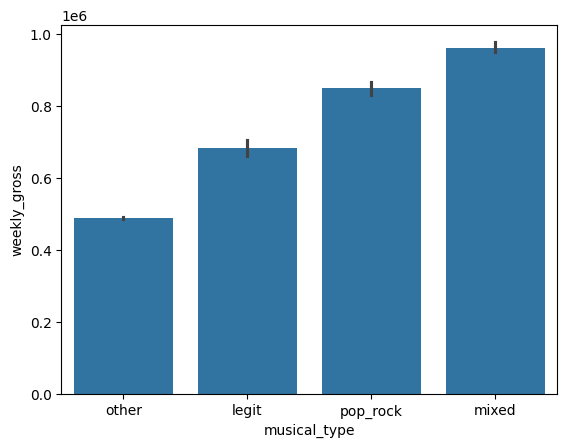

Regarding theatres, same happened but no classification was considered. Instead, an encapsulation was made based on the theatres that were more present in the database (i.e. those with more activity)

``` Python
df_grosses.theatre.value_counts()

theatre
Other                 37476
Broadhurst Theatre     1829
Minskoff Theatre       1739
Majestic Theatre       1677
Imperial Theatre       1673
Ambassador Theatre     1604
Gershwin Theatre       1526
Name: count, dtype: int64
```

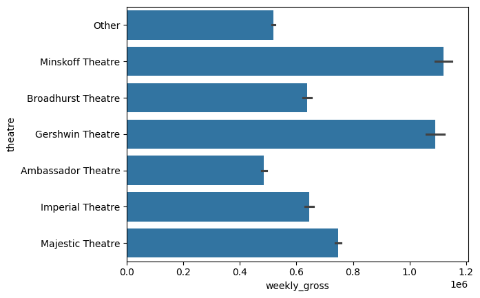


### Specific Exploratory Data Analysis of Numerical Variables

An initial correlation matrix was conducted to check for multicollinearity in the numerical variables. The dependant variable (weekly_gross) was already included to check for multicollinearity with the other variables and see if any explicative variable was highly correlated to it (therefore could potentially explain it fairly well). 


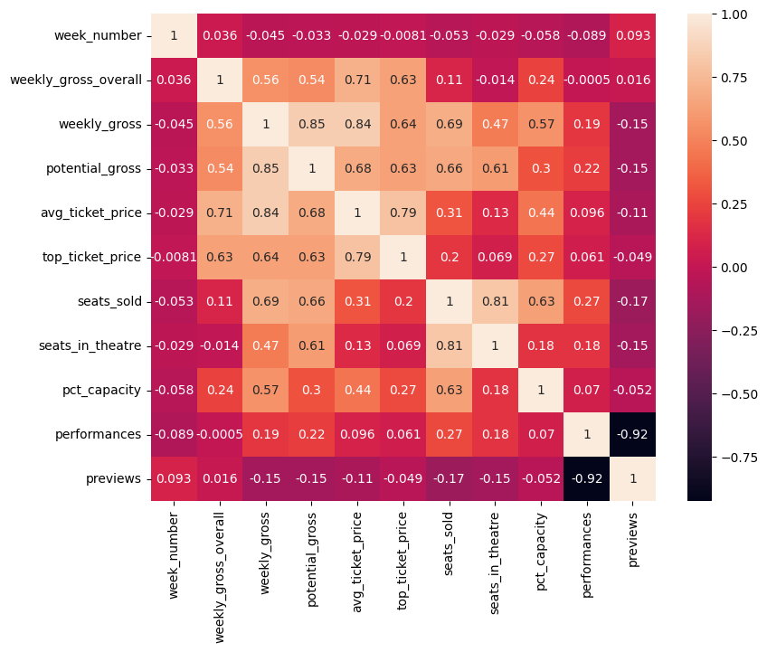

There is a high correlation (>0.9) between variables 'performance' and 'previews'. Previews was then dropped from the database in order to avoid model overfitting. 'Previews' was chosen as 'performances' was consider more relevant to explain the weekly grosses; it also had more 0s than 'performances'.

Scatterplots were made in order to check whether there was a linearity between the dependant variable (week_gross) and each of the explanatory variables:

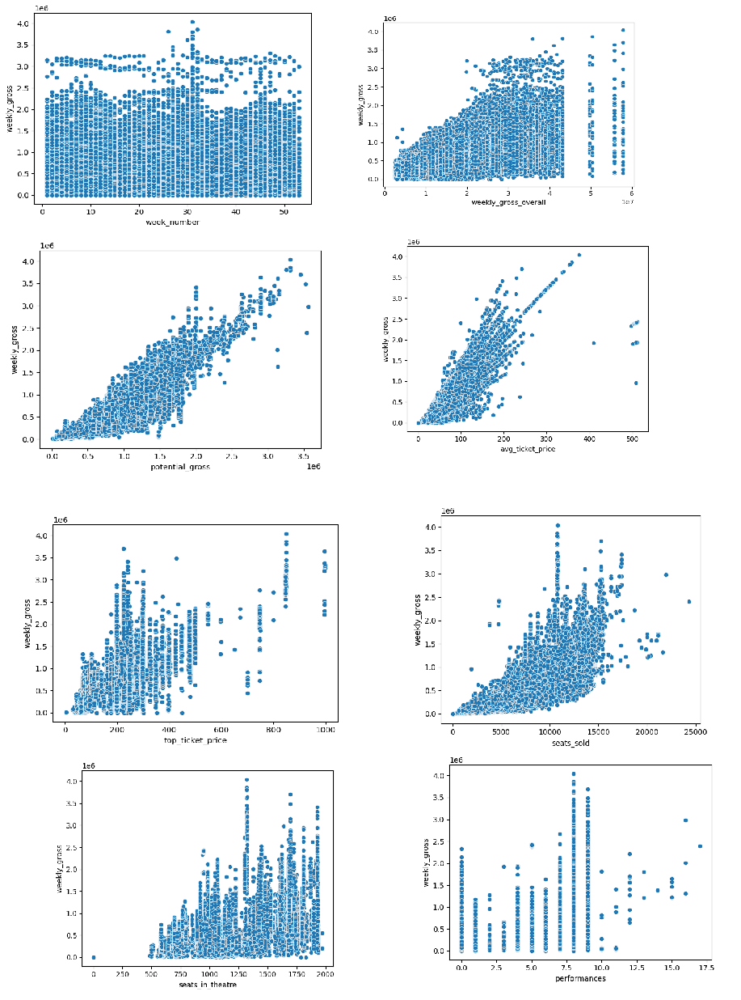

Some associations show a linear positive relationship (when one variable increases, the other does too) such as avg_ticket price or seats sold. However, others such as number of weeks show a different shape (more uniform).


Then, distributions of each numeric variable were checked using a histogram. Also, missing values where imputed using the mean values of the corresponding variable. Finally, cases where the value had no sense it was also treated (e.g. the variable seats in theatre had some 0s, so these were transformed to null and then imputed).

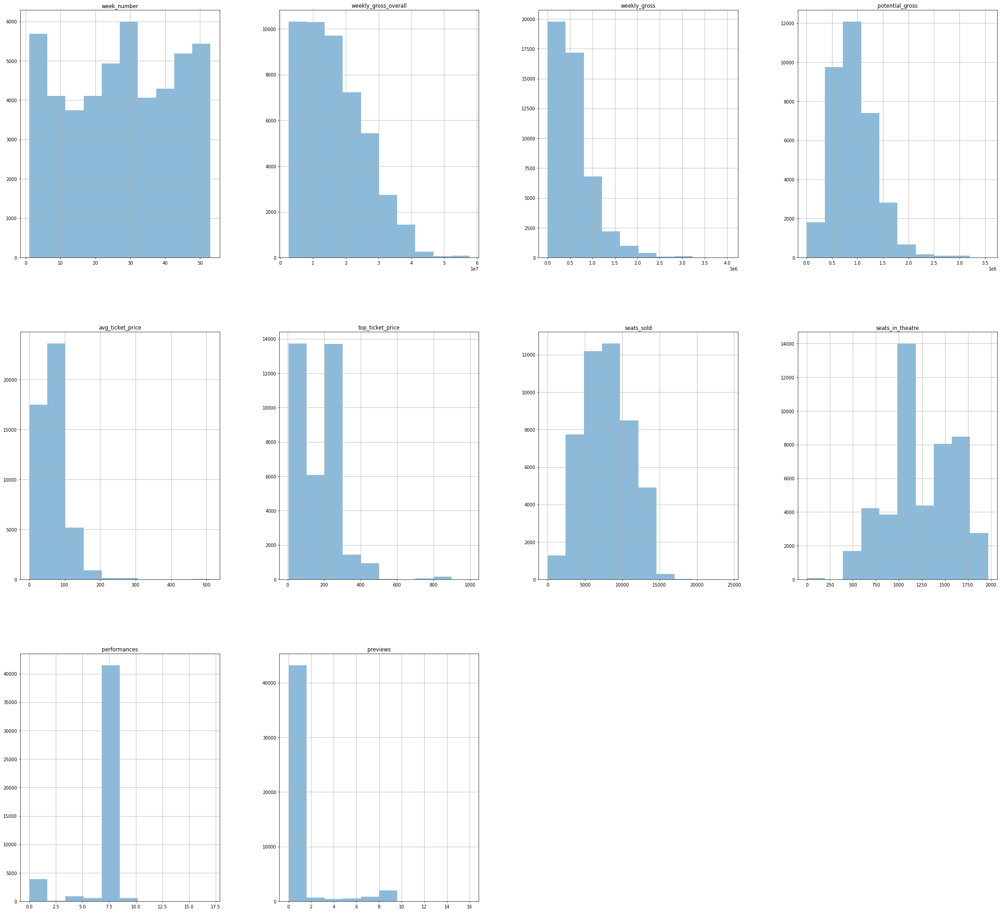

Transformations were made based on logarithms or square roots. If the distribution contained 0s (none had negative values) the squared root method was considered the first option, as logarithms of 0 are 1 and the variable would be weighted to 1. In any case, both methods were checked to see which one produced a more normalized distribution. The transformed variable was added to the dataframe and the original variable was dropped.

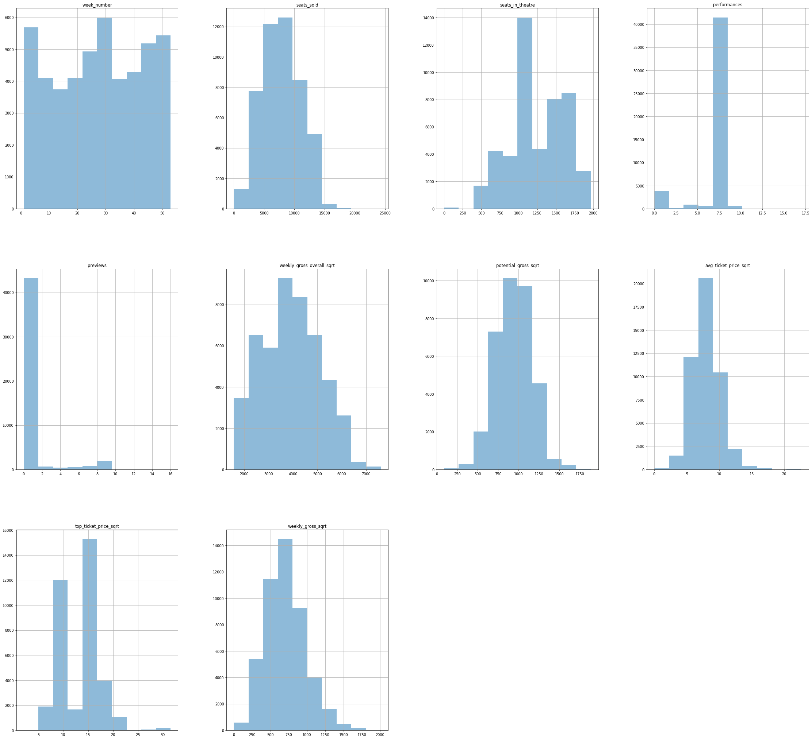histog_post-transf

Outliers were then revised by checking the distributions. Most variables had a bit of positive skewness,except the average ticket price that had both positive and negative. Boxplots were also revised to see the outliers more easily. Let´s see the top ticket price  to illustrate this:

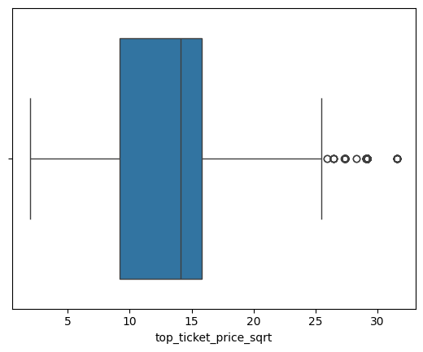

Some other variables such as the performances did not required treatment of outliers or the distribution was not a Normal (e.g. week number, which is basically Uniform).

The Interquartile Range (IQR) was calculated for each variables with outliers. This measures the values that fall between the 1st and the 3rd quartile (therefore excluding extreme values). Upper or lower limits were constructed to include those values considered extreme. if the N was small and reasonable enough, these were dropped from the variables. Then, distributions and plots were again revised to check the shape of the variables after this transformation.

PONER BOXPLOT THE TOP TICKET TRAS LOS OUTLIERS

A double-check was also made on the numerical variables to check if sales and performances were zero (this would not mean errors but for some reason e.g. closures etc. and these values would not be transformed).

The correlation matrix was plotted again after the transformations. On those variables where the correlation was higher than 0.7 regressions of Xs were made to double-check them:

```Python
model = LinearRegression().fit(regression[['seats_sold']], regression[['seats_in_theatre']])
model.score(regression[['seats_sold']], regression[['seats_in_theatre']])

0.6505750768993934
```

```Python
model = LinearRegression().fit(regression[['weekly_gross_overall_sqrt']], regression[['avg_ticket_price_sqrt']])
model.score(regression[['weekly_gross_overall_sqrt']], regression[['avg_ticket_price_sqrt']])

0.6320184747446843
```

None of them were discarded as the R2 was considered not high enough.

### Final Steps before the Model:
Now variables were clean and transformed, categorical variables were encoded in order to be included in the model. The encoding was performed using the OneHotEncoder from Sklearn. One of the categories (legit for musical_types and Ambassador theatre for theatres)was not considered by this method in order to avoid model overfitting.

Numerical data was then normalized, scaled and standarised (also with the Normalizer, MinMaxScaler and StandardScaler methods from Sklearn) to check the best method to transform the data.

## Regression Modelling

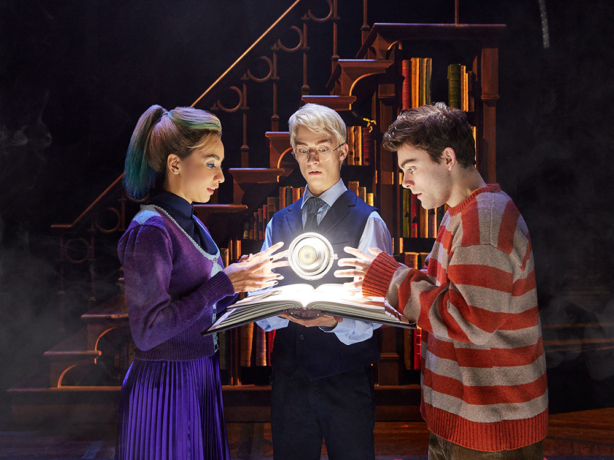

The OLS model was presented using the Linear Regression Library:

``` Python

                            OLS Regression Results                            
==============================================================================
Dep. Variable:      weekly_gross_sqrt   R-squared:                       0.639
Model:                            OLS   Adj. R-squared:                  0.639
Method:                 Least Squares   F-statistic:                     4663.
Date:                Sun, 05 May 2024   Prob (F-statistic):               0.00
Time:                        11:56:56   Log-Likelihood:            -2.8389e+05
No. Observations:               44765   AIC:                         5.678e+05
Df Residuals:                   44747   BIC:                         5.680e+05
Df Model:                          17                                         
Covariance Type:            nonrobust                                         
==============================================================================================
                                 coef    std err          t      P>|t|      [0.025      0.975]
----------------------------------------------------------------------------------------------
const                       -164.9451     23.552     -7.003      0.000    -211.108    -118.782
week_number                -1.291e+04    313.337    -41.199      0.000   -1.35e+04   -1.23e+04
seats_sold                  1242.7544     18.429     67.435      0.000    1206.633    1278.875
seats_in_theatre           -1445.7659     22.771    -63.491      0.000   -1490.398   -1401.134
performances               -1.278e+05   1862.943    -68.624      0.000   -1.31e+05   -1.24e+05
weekly_gross_overall_sqrt    355.1243     14.289     24.853      0.000     327.118     383.131
potential_gross_sqrt       -1195.8101     37.600    -31.804      0.000   -1269.506   -1122.114
avg_ticket_price_sqrt       2.802e+05   5057.817     55.409      0.000     2.7e+05     2.9e+05
top_ticket_price_sqrt      -9769.0658   2286.574     -4.272      0.000   -1.43e+04   -5287.343
theatre_Broadhurst Theatre     2.4801      4.856      0.511      0.610      -7.038      11.999
theatre_Gershwin Theatre      61.3559      5.842     10.502      0.000      49.905      72.806
theatre_Imperial Theatre      39.3591      4.916      8.006      0.000      29.723      48.995
theatre_Majestic Theatre     117.8626      4.912     23.997      0.000     108.236     127.489
theatre_Minskoff Theatre     147.4619      5.312     27.762      0.000     137.051     157.873
theatre_Other                -25.3525      3.552     -7.138      0.000     -32.314     -18.391
musical_type_mixed             9.3696      5.099      1.838      0.066      -0.624      19.364
musical_type_other          -138.8629      4.628    -30.007      0.000    -147.933    -129.793
musical_type_pop_rock         -0.6343      5.070     -0.125      0.900     -10.572       9.303
==============================================================================
Omnibus:                      850.540   Durbin-Watson:                   1.463
Prob(Omnibus):                  0.000   Jarque-Bera (JB):             1116.493
Skew:                           0.251   Prob(JB):                    3.60e-243
Kurtosis:                       3.588   Cond. No.                     1.43e+04
==============================================================================

Notes:
[1] Standard Errors assume that the covariance matrix of the errors is correctly specified.
[2] The condition number is large, 1.43e+04. This might indicate that there are
strong multicollinearity or other numerical problems.
```

Most variables are significant (i.e. make an effect in the dependant variable) except the fact that the musical is showd in the Bradhurst Theatre or whether it was a pop-rock musical or mixed. This is also shown in the fact that the confidence intervals for these variables include the 0. As a result, the effect of these inputs may be any (positive, zero, negative) so no conclusions can be extracted from them.
Other variables such as the top price of tickets or the number of seats sold clearly have an impact on weekly grosses. For example, a seat sold increases the weekly grosses in 1,242$. The fit of the model is pretty good given that the R2 is 0.63 (63% of variations in Y correspond to variations in Xs).

However, when we standarise or scale the variables the results differ!:

*Scaled Model*

``` Python 

                            OLS Regression Results                            
==============================================================================
Dep. Variable:      weekly_gross_sqrt   R-squared:                       0.989
Model:                            OLS   Adj. R-squared:                  0.989
Method:                 Least Squares   F-statistic:                 2.431e+05
Date:                Sat, 04 May 2024   Prob (F-statistic):               0.00
Time:                        13:10:40   Log-Likelihood:            -2.0516e+05
No. Observations:               44765   AIC:                         4.104e+05
Df Residuals:                   44747   BIC:                         4.105e+05
Df Model:                          17                                         
Covariance Type:            nonrobust                                         
==============================================================================================
                                 coef    std err          t      P>|t|      [0.025      0.975]
----------------------------------------------------------------------------------------------
const                       -129.5257      1.252   -103.479      0.000    -131.979    -127.072
week_number                    0.2375      0.382      0.622      0.534      -0.511       0.986
seats_sold                   645.8851      1.065    606.397      0.000     643.797     647.973
seats_in_theatre             -44.6251      0.890    -50.160      0.000     -46.369     -42.881
performances                   2.1822      0.635      3.434      0.001       0.937       3.428
weekly_gross_overall_sqrt     -1.1675      0.903     -1.293      0.196      -2.937       0.602
potential_gross_sqrt         163.2131      1.394    117.055      0.000     160.480     165.946
avg_ticket_price_sqrt        843.4455      1.323    637.306      0.000     840.852     846.040
top_ticket_price_sqrt        -29.4076      1.141    -25.772      0.000     -31.644     -27.171
theatre_Broadhurst Theatre     1.1643      0.837      1.391      0.164      -0.477       2.805
theatre_Gershwin Theatre     -11.2081      1.012    -11.078      0.000     -13.191      -9.225
theatre_Imperial Theatre      -9.0004      0.846    -10.639      0.000     -10.659      -7.342
theatre_Majestic Theatre     -13.6928      0.852    -16.077      0.000     -15.362     -12.023
theatre_Minskoff Theatre      -4.4660      0.922     -4.845      0.000      -6.273      -2.659
theatre_Other                 -3.9266      0.612     -6.415      0.000      -5.126      -2.727
musical_type_mixed            10.9158      0.882     12.374      0.000       9.187      12.645
musical_type_other            -1.3214      0.808     -1.636      0.102      -2.904       0.262
musical_type_pop_rock          2.0531      0.876      2.344      0.019       0.336       3.770
==============================================================================
Omnibus:                    12213.734   Durbin-Watson:                   1.835
Prob(Omnibus):                  0.000   Jarque-Bera (JB):           115542.769
Skew:                          -1.042   Prob(JB):                         0.00
Kurtosis:                      10.590   Cond. No.                         35.2
==============================================================================

Notes:
[1] Standard Errors assume that the covariance matrix of the errors is correctly specified.
```

*Standarised Model*

``` Python

                            OLS Regression Results                            
==============================================================================
Dep. Variable:      weekly_gross_sqrt   R-squared:                       0.989
Model:                            OLS   Adj. R-squared:                  0.989
Method:                 Least Squares   F-statistic:                 2.431e+05
Date:                Sun, 05 May 2024   Prob (F-statistic):               0.00
Time:                        12:23:51   Log-Likelihood:            -2.0516e+05
No. Observations:               44765   AIC:                         4.104e+05
Df Residuals:                   44747   BIC:                         4.105e+05
Df Model:                          17                                         
Covariance Type:            nonrobust                                         
==============================================================================================
                                 coef    std err          t      P>|t|      [0.025      0.975]
----------------------------------------------------------------------------------------------
const                        676.6278      0.995    679.917      0.000     674.677     678.578
week_number                    0.0702      0.113      0.622      0.534      -0.151       0.291
seats_sold                   131.3596      0.217    606.397      0.000     130.935     131.784
seats_in_theatre             -10.5059      0.209    -50.160      0.000     -10.916     -10.095
performances                   0.4093      0.119      3.434      0.001       0.176       0.643
weekly_gross_overall_sqrt     -0.2661      0.206     -1.293      0.196      -0.669       0.137
potential_gross_sqrt          21.1504      0.181    117.055      0.000      20.796      21.505
avg_ticket_price_sqrt        143.6694      0.225    637.306      0.000     143.228     144.111
top_ticket_price_sqrt         -4.2817      0.166    -25.772      0.000      -4.607      -3.956
theatre_Broadhurst Theatre     1.1643      0.837      1.391      0.164      -0.477       2.805
theatre_Gershwin Theatre     -11.2081      1.012    -11.078      0.000     -13.191      -9.225
theatre_Imperial Theatre      -9.0004      0.846    -10.639      0.000     -10.659      -7.342
theatre_Majestic Theatre     -13.6928      0.852    -16.077      0.000     -15.362     -12.023
theatre_Minskoff Theatre      -4.4660      0.922     -4.845      0.000      -6.273      -2.659
theatre_Other                 -3.9266      0.612     -6.415      0.000      -5.126      -2.727
musical_type_mixed            10.9158      0.882     12.374      0.000       9.187      12.645
musical_type_other            -1.3214      0.808     -1.636      0.102      -2.904       0.262
musical_type_pop_rock          2.0531      0.876      2.344      0.019       0.336       3.770
==============================================================================
Omnibus:                    12213.734   Durbin-Watson:                   1.835
Prob(Omnibus):                  0.000   Jarque-Bera (JB):           115542.769
Skew:                          -1.042   Prob(JB):                         0.00
Kurtosis:                      10.590   Cond. No.                         27.7
==============================================================================

Notes:
[1] Standard Errors assume that the covariance matrix of the errors is correctly specified.
```

The R2 in both standarised and scaled models is too good! are overfitting the model? why the normalised is better and the other 2 exactly match in such a high number?

When revising again the distributions of the normalised, standard and scaled variables:

*Normalised*

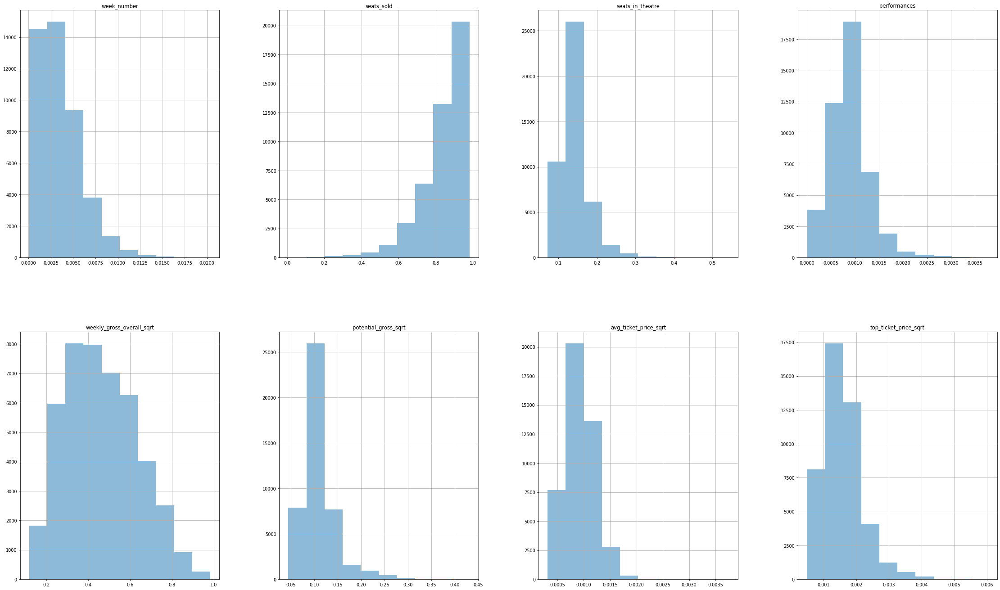

*Scaled*

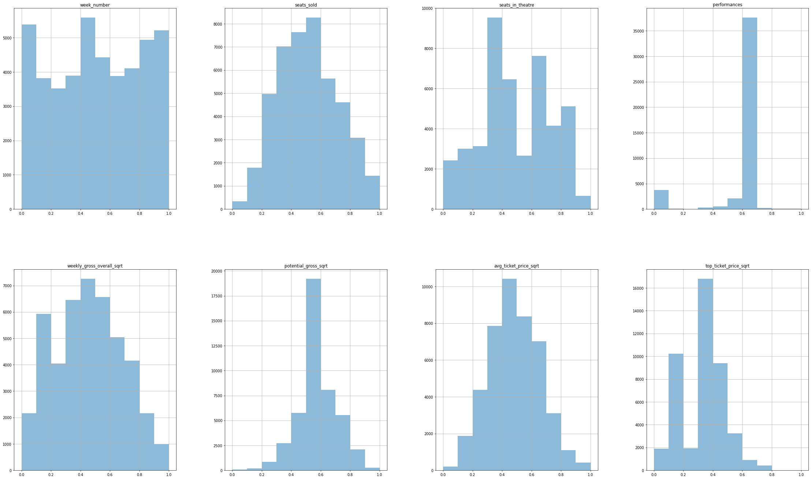

*Standarised*

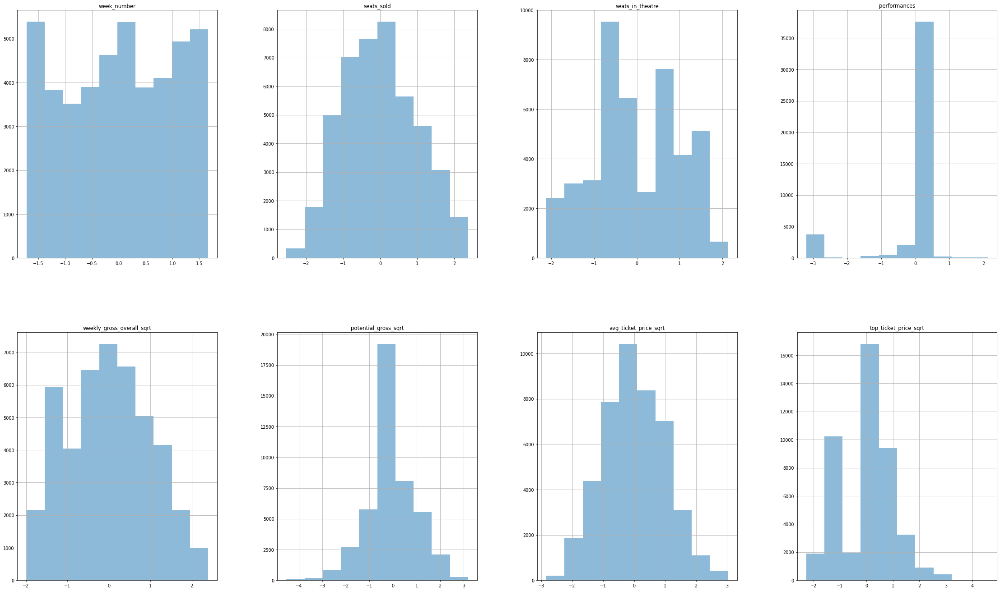

Results show that the normalised are now skewed! the shape of the standarised and scaled ones is practically identical and much more centered. The normalisation is not a good approach for this dataset. This means that the weekly grosses is really well explained by the explicative variables selected.

### Wait! but...is it not TOO good?

Maybe the reason for such good fit is that we are including variables that are highly correlated to the weekly grosses. The correlation matrix didn't show it but the average ticket is mainly the grosses by the number of tickets sold (i.e. number of seats sold in way). But as it is the average the correlation doesn't show that well in the matrix. 
Also, variables 'seats in theatre' is quite correlated to seats sold. And potential gross as well as weekly gross overall might be quite related to the Y? There is quite high correlation (~0.6-0.7) between some dependant variables and also with the Y. So...let's take all these from the analysis!


*Standarised*

``` Python
                            OLS Regression Results                            
==============================================================================
Dep. Variable:      weekly_gross_sqrt   R-squared:                       0.747
Model:                            OLS   Adj. R-squared:                  0.747
Method:                 Least Squares   F-statistic:                 1.016e+04
Date:                Mon, 06 May 2024   Prob (F-statistic):               0.00
Time:                        19:45:06   Log-Likelihood:            -2.7595e+05
No. Observations:               44765   AIC:                         5.519e+05
Df Residuals:                   44751   BIC:                         5.521e+05
Df Model:                          13                                         
Covariance Type:            nonrobust                                         
==============================================================================================
                                 coef    std err          t      P>|t|      [0.025      0.975]
----------------------------------------------------------------------------------------------
const                        756.3559      4.795    157.744      0.000     746.958     765.754
week_number                   -1.0878      0.547     -1.990      0.047      -2.159      -0.016
seats_sold                   163.1829      0.644    253.301      0.000     161.920     164.446
performances                   5.6318      0.566      9.958      0.000       4.523       6.740
top_ticket_price_sqrt         75.4082      0.581    129.770      0.000      74.269      76.547
theatre_Broadhurst Theatre   -33.8905      4.053     -8.361      0.000     -41.835     -25.946
theatre_Gershwin Theatre    -129.8910      4.840    -26.839      0.000    -139.377    -120.405
theatre_Imperial Theatre     -71.2440      4.094    -17.402      0.000     -79.268     -63.220
theatre_Majestic Theatre     -57.1108      4.131    -13.826      0.000     -65.207     -49.014
theatre_Minskoff Theatre     -38.7829      4.454     -8.706      0.000     -47.514     -30.052
theatre_Other                -50.9115      2.966    -17.165      0.000     -56.725     -45.098
musical_type_mixed            13.2716      4.251      3.122      0.002       4.939      21.604
musical_type_other           -47.0988      3.886    -12.121      0.000     -54.715     -39.483
musical_type_pop_rock         42.0663      4.237      9.928      0.000      33.761      50.371
==============================================================================
Omnibus:                      378.584   Durbin-Watson:                   0.827
Prob(Omnibus):                  0.000   Jarque-Bera (JB):              341.458
Skew:                          -0.171   Prob(JB):                     7.13e-75
Kurtosis:                       2.742   Cond. No.                         24.5
==============================================================================

Notes:
[1] Standard Errors assume that the covariance matrix of the errors is correctly specified.

```
The  scaled histograms have this shape:

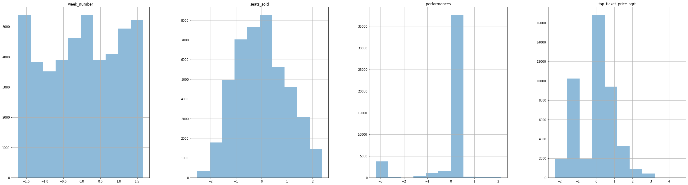

In this case, the model fits much more reasonable...the R2 says that 75% of the changes in weekly grosses are explained by the Xs. The variable weeknumber is non significant but it makes sense as it has no linear relationship with the Y

### Split, train, test

In order to check the model, we are goint to split it to train and test:

```Python 
X=pd.concat((df_x_standarised, df_x_encoded), axis=1) 
Y=pd.DataFrame(Y)
X_train, X_test, y_train, y_test= train_test_split(X,Y, test_size=0.8, random_state=42)
lm=linear_model.LinearRegression()
model=lm.fit(X_train, y_train)
predictions=lm.predict(X_test)

r2=r2_score(y_test, predictions)
print(r2)

0.7470755563396854

``` 

After the training and the test, predictions show that the R2 of the model is 0.75, which is very similar to the OLS model. We can say our model is robust.


## ** Conclusions ** 

Broadway is a world full of magic and sound...but also full of profits. Time Series analysis show the positive tendency over years regarding grosses (unless something unexpected happens!). The linear regression OLS model shows that, when accounting for outliers, skeweness and missing values, the weekly grosses can be explained not only for the shows displayed but also for the theatres, the ticket sales and the number of performances.